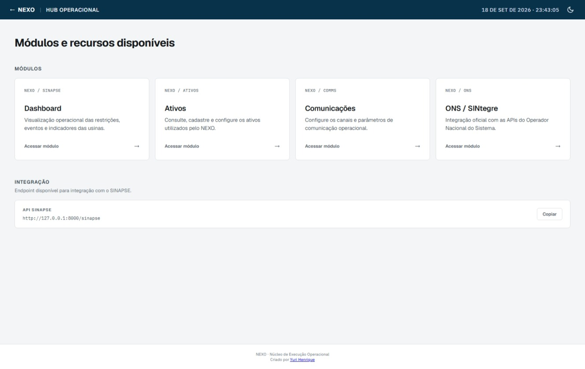
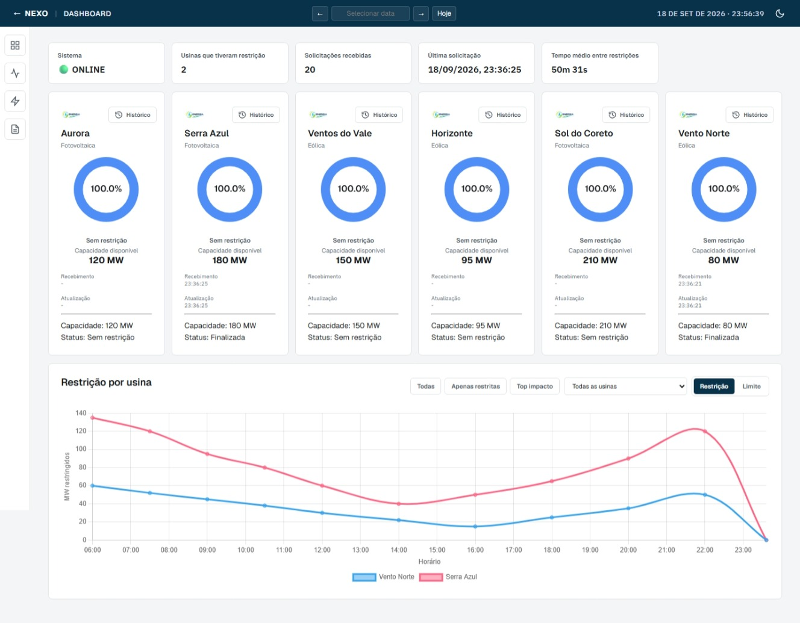
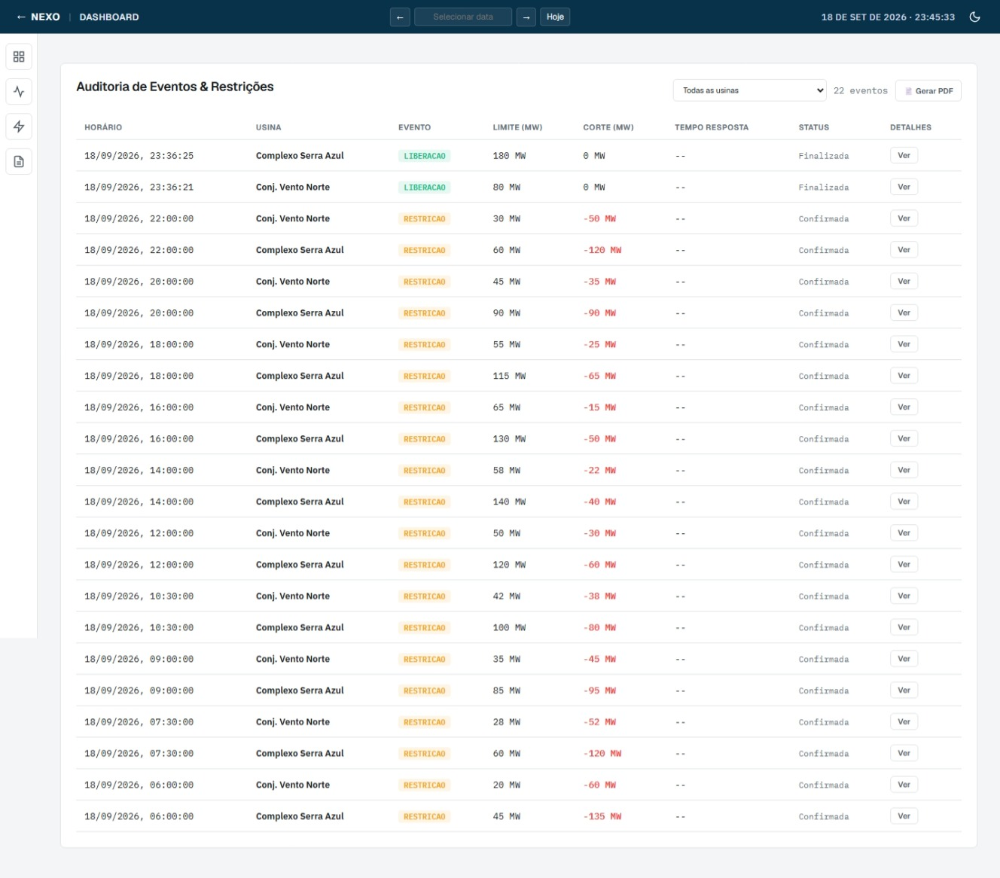
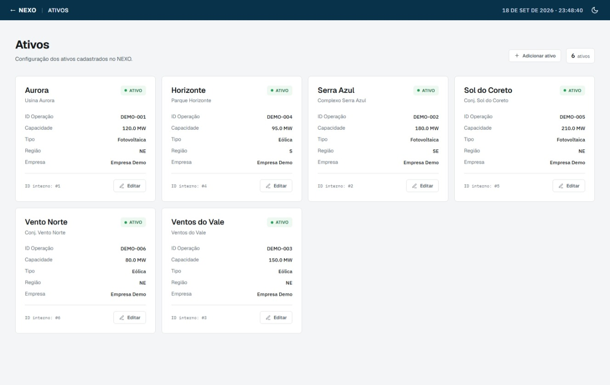
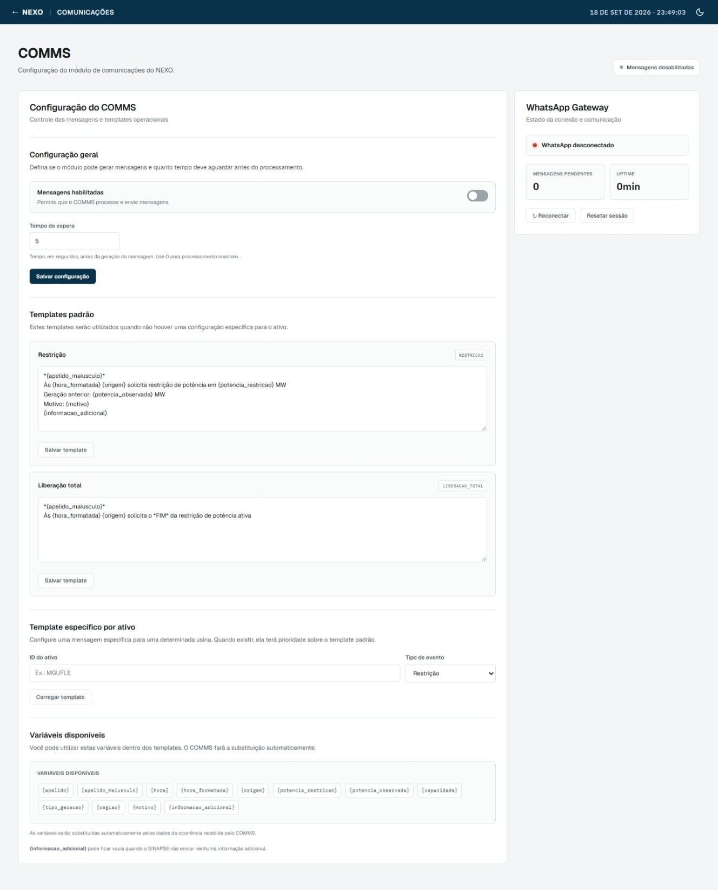
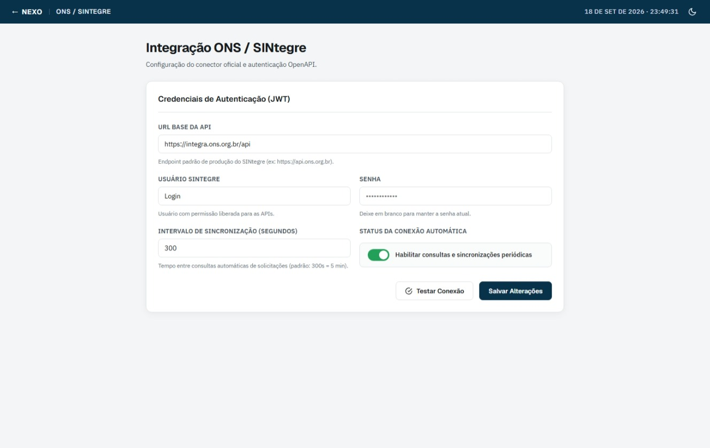

# NEXO

**Núcleo de Execução Operacional**

Plataforma modular para execução, monitoramento e integração de processos operacionais.

Pode facilmente ter módulos adicionados e criados, funcionando como plugins que são lidos ao iniciar.

Desenvolvido por **Yuri Henrique**.

## Screenshots

## Documentação

- [Arquitetura](docs/architecture.md)
- [Guia de Desenvolvimento](docs/development-guide.md)
- [Fluxo do Gateway/whatsapp](docs/fluxo%20gateway.md)
- [Decisões Arquiteturais](docs/decisions/)

## Tecnologias

- Python
- FastAPI
- SQLAlchemy
- SQLite
- JavaScript
- HTML/CSS
- Node.js
- Baileys

## Licença

Este projeto é distribuído sob a [Apache License 2.0](LICENSE).
